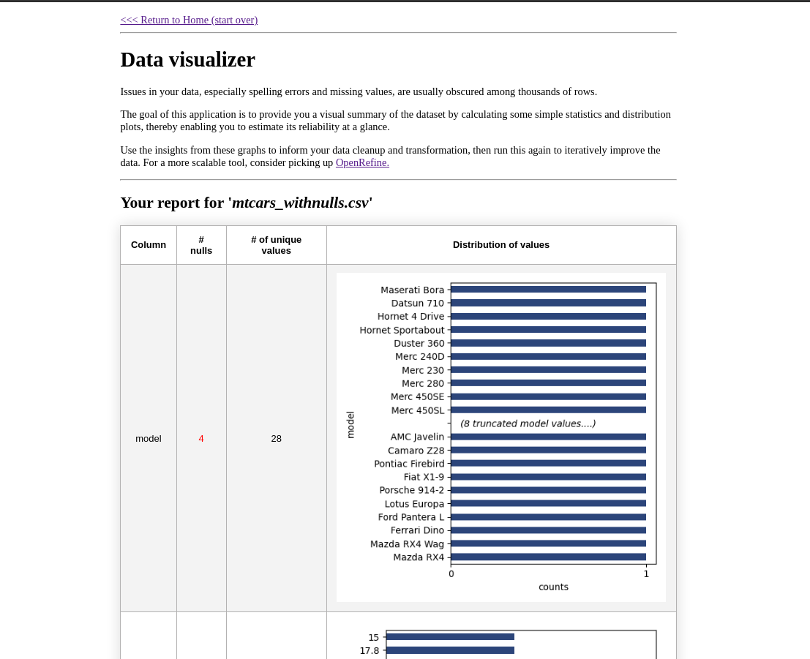

# Data Visualizer

A Flask application that generates simple statistics and a visual summary of your CSV/Excel dataset to highlight underlying issues in your data, especially spelling errors and missing values. 

## How to use

1. Create a virtual environment with `virtualenv` and activate it. 

2. Install the dependencies with

```{sh}
$ pip install -r requirement.txt
```

3. Start flask

```
$ flask run
```

4. Upload the csv file (a modified mtcars dataset) in `sample-data/` to generate sample report shown in the screenshot below.

## Screenshot

