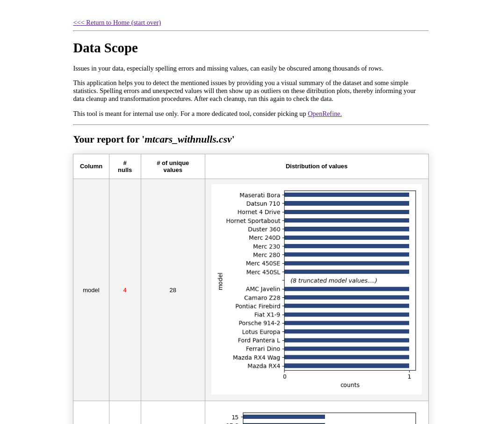

# Data Scope

A Python 3 Flask application that generates simple statistics and a visual summary of your CSV/Excel dataset to highlight underlying issues in your data, especially spelling errors and missing values. 

## Getting started

1. Clone this repository
2. (Optional) Create a `virtualenv` virtual environment with and activate it. 

3. Install the dependencies with

```{sh}
pip install -r requirement.txt
```

4. Start flask

```
flask run
```

5. Upload the csv file (a modified mtcars dataset) from `sample-data/` to generate sample report shown in the screenshot below.

## Screenshot

